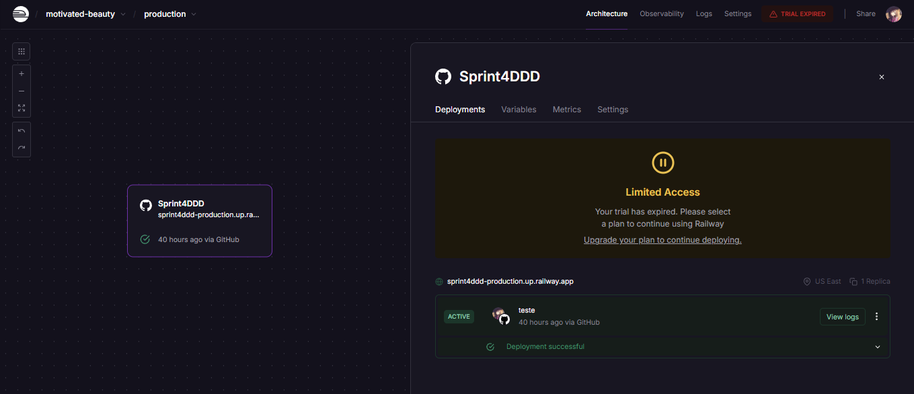

⚠️ Aviso: A API utilizada pode apresentar instabilidades, pois a versão de teste expirou.

---

# Front-End Design Engineering  
### **Turma:** 1TDSPB 

---

O projeto Conectrilhos foi desenvolvido utilizando Next.js 15.2.3, com foco em boas práticas de desenvolvimento, garantindo organização semântica, responsividade e experiência de usuário intuitiva.
Este projeto foi desenvolvido com o intuito de aprimorar a experiência dos usuários de transporte público, oferecendo informações claras e atualizadas.
---

## Estrutura Geral do Projeto

### **Página Inicial (Home.tsx)**  
**Descrição:** Apresenta o projeto Conectrilhos e exibe a interface de login do usuário..  
**Características:**
- Exibição do título principal da aplicação.  
- Com a utilização de (`form`),(`div`),(`input`) e (`label`) possibilitamos campos de entrada para usuário e senha. contendo também a inclusão de botão com ícone interativo para exibição da senha.
- Design limpo e direto, garantindo usabilidade e acessibilidade.

---

### **Página de Serviços (page.tsx)**  
**Descrição:** Exibe diversas informações úteis para o usuário sobre os serviços do sistema de transporte.  
**Características:**
- Há um campos de entrada no inicio da pagina utilizando (`<section>`) e (`<SearchBar>`) para o usuário possibilitando pesquisa dinâmica com a intenção de filtrar serviços.
- Mapas: Visualização interativa das linhas de transporte.  
- Status do Sistema: Atualizações em tempo real das operações.
- Mensagens do Sistema: Comunicados oficiais e avisos.
- Informações Gerais: Tarifas, horários e orientações.
- O codigo utilizado majoratoriamente para as "blocagens" de codigo foi a tag (`<section>`).

---

### **Página de suporte ao usuário (faq.tsx)**  
**Descrição:**  Página interativa que responde às dúvidas mais comuns dos usuários, totalmente dedicadas a cupons, status da via, carteira digital e suporte ao usuário.
**Características:**
- Estrutura com foco na interatividade dinamica, utilizando tags como `<accordion>` e `
` para a visibilidade da expansão e retenção dos tópicos .   
- Design consistente com a identidade visual do projeto. Alta responsividade para garantir uma experiência fluida.  
- Campo de busca integrado para facilitar a busca de dúvidas frequentes.

---

### **Video de Apresentração do Projeto:**
- https://drive.google.com/file/d/1ntEdCbE6jq4ZkvHJNWDfMoqzMoVVVf5F/view
 
---

### Membros do Projeto
Feedbacks são bem-vindos para melhorias contínuas! 🚆🚀

| Gabriel Gomes                                                                                   | Natasha Mauricio                                                                               | Victor Rodrigues                                                                              |
|-------------------------------------------------------------------------------------------------|------------------------------------------------------------------------------------------------|------------------------------------------------------------------------------------------------|
|  |  |  |
| **RM: 559597**                                                                                 | **RM: 561159**                                                                                 | **RM: 560087**                                                                                |
| [LinkedIn](https://www.linkedin.com/in/gabriel-gomes-cardoso-4513a9326/)   [GitHub](https://github.com/gaaaabz) | [LinkedIn](https://www.linkedin.com/in/natasha-mauricio-silva-santana/)   [GitHub](https://github.com/Natasha-Mauricio) | [LinkedIn](https://www.linkedin.com/in/victorrodrigues1227)   [GitHub](https://github.com/VoyDcode) |
